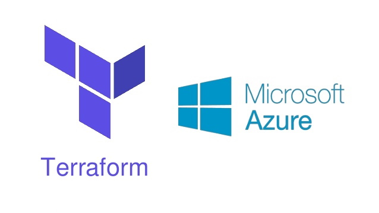

# Azure Infrastructure Operations Project: Ensuring Quality Releases

> This project develops and demonstrates the use of a variety of industry leading tools, especially Microsoft Azure, to create disposable test environments and run a variety of automated tests with the click of a button. Additionally, it shows how to monitor and provide insight into your application's behavior, and determine root causes by querying the application’s custom log files.

## Project Steps

The project has the following steps:

1. Use Terraform to create the following resources for a specific environment tier:
   - AppService
   - Network
   - Network Security Group
   - Public IP
   - Resource Group
   - Linux VM (created by you -- use a Standard_B1s size for lowest cost)

2. For the Azure DevOps CI/CD pipeline:
   - Create the tasks that allow for Terraform to run and create the above resources.
   - Execute Test Suites for:
   - Postman - runs during build stage
   - Selenium - runs on the linux VM in the deployment stage
   - JMeter - runs against the AppService in the deployment stage

3. For Postman:
   - Create a Regression Test Suite from the Starter APIs. Use the Publish Test Results task to publish the test results to Azure Pipelines.
   - Create a Data Validation Test Suite from the Starter APIs.

4. For Selenium:
   - Create a UI Test Suite that adds all products to a cart, and then removes them.
   - Include print() commands throughout the tests so the actions of the tests can easily be determined. E.g. A login function might return which user is attempting to log in and  - whether or not the outcome was successful.
   - Deploy the UI Test Suite to the linux VM and execute the Test Suite via the CI/CD pipeline.

5. For JMeter:
   - Use the starter APIs to create two Test Suites. Using variables, reference a data set (csv file) in the test cases where the data will change.
   - Create a Stress Test Suite
   - Create a Endurance Test Suite
   - Generate the HTML report (non-CI/CD) IMPORTANT: Since the AppService is using the Basic/Free plan, start small (2 users max) and once you are ready for the final submission, use up to 30 users for a max duration of 60 seconds. The "Data Out" quota for the AppService on this plan is only 165 MiB.

6. For Azure Monitor:
   - Configure an Action Group (email)
   - Configure an alert to trigger given a condition from the AppService
   - The time the alert triggers and the time the Performance test is executed ought to be very close.
   - Direct the output of the Selenium Test Suite to a log file, and execute the Test Suite. Configure custom logging in Azure Monitor to ingest this log file.This may be done non-CI/CD.

## Built With

* [Azure](https://portal.azure.com/) - Cloud service provider used
* [Azure DevOps](https://azure.microsoft.com/en-us/solutions/devops/) - Cloud build server used
* [Selenium](https://www.selenium.dev/) - Automated browser testing tool used
* [Terraform](https://www.terraform.io/) - Cloud infrastructure resource provisioning service used
* [JMeter](https://jmeter.apache.org/) - Load testing and performance measuring tool used
* [Postman](https://www.postman.com/) - API Platform provider used

## Authors

* **[Pemberai Sweto](https://github.com/thepembeweb)** - *Initial work* - [Ensuring Quality Releases in Azure](https://github.com/thepembeweb/ensuring-quality-releases)

## License

- This project is licensed under the MIT License - see the [LICENSE.md](LICENSE.md) file for details
- Copyright 2020 © [Pemberai Sweto](https://github.com/thepembeweb).

